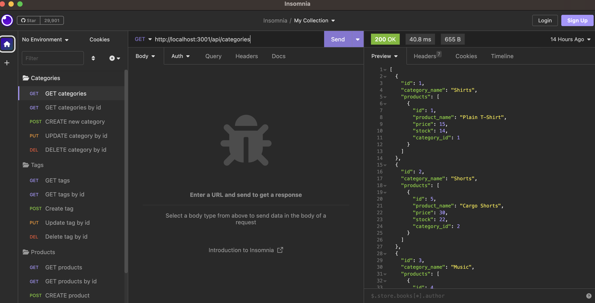
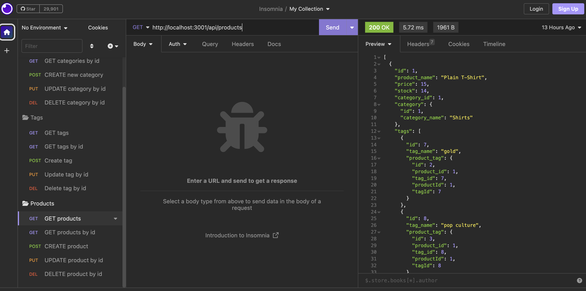
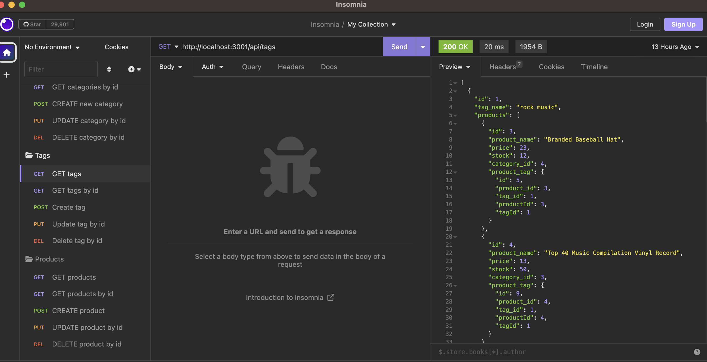

# Ecommerce-DMBS

## Description

- This project was created to provide a user a way to update and create product information within a SQL database. This project took it a step further and implemented an ORM to be able to send post requests to the server using JavaScript as opposed to only using SQL syntax to update the database. The project implemented Sequelize as the ORM of choice. Learning how to implement all the methods used within Sequelize proved to be a challenge, as well as setting up the many to many relationships between models/tables. Overall the challenge helped in giving me a better understanding of ORMs

## Table of Contents

- [Installation](#installation)
- [Usage](#usage)
- [Credits](#credits)
- [License](#license)
- [Contributions](#how-to-contribute)
- [Tests](#tests)
- [Questions](#questions)

## Installation

- Navigate to: https://www.github.com/alexanderolivares13/Ecommerce-DBMS
- Clone the Github repository to any directory of your choice. Open the terminal/bash
- Run mysql and run the schema.sql in the db folder using `SOURCE db/schema.sql`
- Next run `npm install` to download all the necessary packages utilized by the program.
- Next run `npm run seed` to to load the database with seed data and aid with testing the functionality.
- Lastly, run `node server.js` to start the server once all the other steps have been completed.

## Usage

- A video tutorial on how to use/test the program with Insomnia is available at: https://drive.google.com/file/d/1Crn72Yy_EP8_NM3EunE0RRPWWdjdeeGe/view

- All of the endpoints of the server must be prefixed with `api/<tablename>` e.g. api/categories
- Use insomnia to test the api endpoints and functionality as shown here:

- The endpoints are `api/categories`, `api/tags`, and `api/products`. When trying to GET, POST, DELETE or put PUT specific values, the `/:id` parameter must be used at the end of the url to specify which category, tag, or product you would like to update.
- Examples are given in greater detail in the video guide.

## Credits

- Starter code was obtained from: https://git.bootcampcontent.com/University-of-Minnesota/UofM-VIRT-FSF-PT-04-2023-U-LOLC-ENTG/-/tree/main/13-ORM/02-Challenge

## License

This project is licensed under the MIT License

## How to Contribute

N/A

## Tests

N/A

## Questions

My work can be found on Github at [alexanderolivares13](https://www.github.com/alexanderolivares13)

If you have any further questions you can contact me at my email at: [alexander.olivares1310@gmail.com](mailto:alexander.olivares1310@gmail.com)
